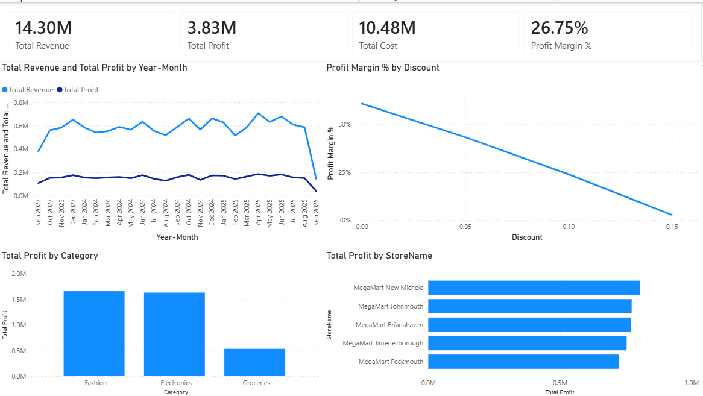
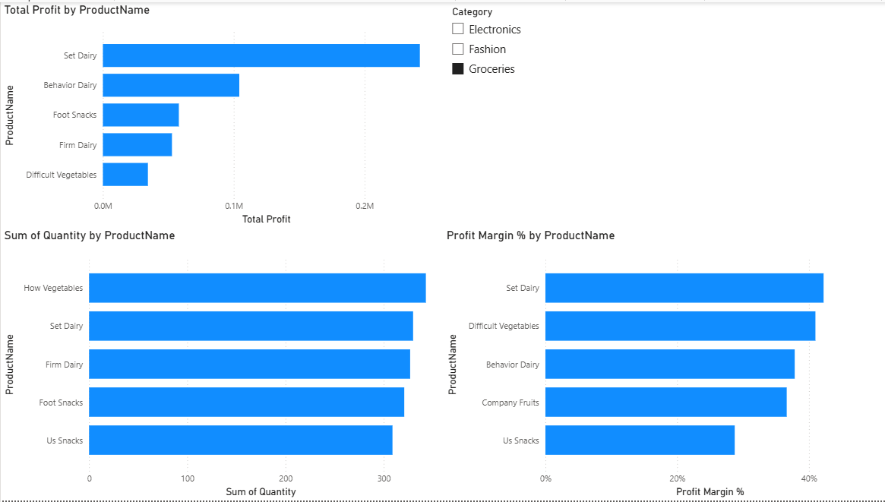
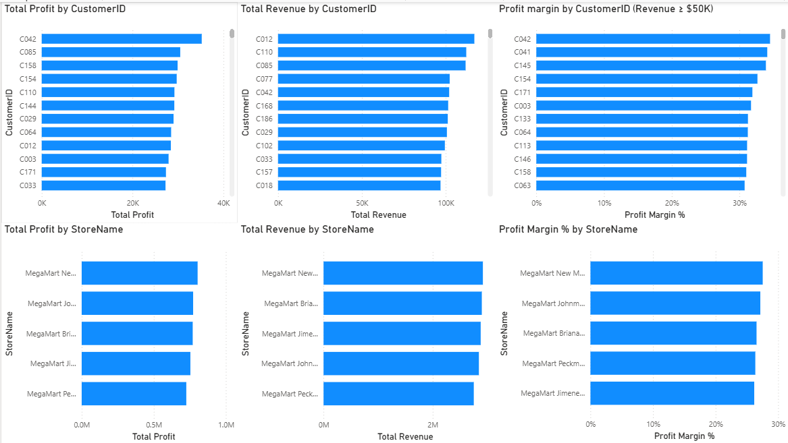

# Retail Profitability Analysis

## Project Overview

This project analyzes retail transaction data to understand the main drivers of revenue and profitability across products, customers, stores, and discount levels.

The analysis combines SQL, Power BI, and Python to move from exploratory analysis to interactive visualization and statistical investigation.

The main objective was to answer practical business questions such as:

- Which products generate the most revenue and profit?
- Which customers contribute the most to the business?
- Which stores perform best in terms of revenue, profit, and profit margin?
- How does discounting affect profitability?
- Are higher sales volumes enough to compensate for the lower margins created by discounts?

## Tools & Technologies

- **SQL** — data exploration, joins, aggregation, and business analysis
- **Power BI** — data modeling, DAX measures, interactive dashboards, and visualization
- **Python** — pandas for data analysis and statsmodels for regression analysis

## Dataset

The dataset contains four related tables:

- `transactions` — individual retail transactions
- `products` — product information, categories, selling prices, and costs
- `customers` — customer information
- `stores` — store information

The analysis is centered around the transactions table, with the other tables providing product, customer, and store attributes.

## SQL Analysis

SQL was used to explore the dataset, join the transaction data with product, customer, and store information, and calculate key profitability metrics.

The analysis included:

- Calculating total revenue, cost, profit, and profit margin
- Analyzing revenue and profit trends over time
- Comparing profitability across product categories and individual products
- Identifying the highest-performing customers and stores
- Examining the relationship between discount levels and profitability

### Key SQL Findings

- Total revenue was approximately **$14.30M**
- Total profit was approximately **$3.83M**
- Overall profit margin was approximately **26.75%**
- Profitability varied across products, categories, customers, and stores
- Higher discount levels were associated with substantially lower profit margins

## Power BI Dashboard

An interactive Power BI dashboard was created to present the results across three analytical views.

### Overview

The overview page summarizes overall business performance, including revenue, cost, profit, profit margin, trends over time, category performance, discount analysis, and store performance.

### Product Analysis

The product analysis page compares individual products based on total profit, units sold, and profit margin. An interactive category slicer allows users to explore performance within Fashion, Electronics, and Groceries.

### Customer & Store Analysis

The final page compares customers and stores across revenue, profit, and profit margin.

To avoid highlighting customers with very high margins but insignificant sales, the customer profit-margin analysis only includes customers with at least **$50,000 in revenue**.

## Python Analysis

Python was used to investigate the relationship between discounting and profitability more deeply.

The four datasets were loaded with pandas, and the financial metrics were independently recreated. The results matched the Power BI calculations:

- **Revenue:** $14.30M
- **Cost:** $10.48M
- **Profit:** $3.83M
- **Profit Margin:** 26.75%

### Discount Analysis

Profit margin consistently decreased as discount levels increased:

| Discount | Transactions | Profit Margin |
|----------|-------------:|--------------:|
| 0% | 1,243 | 32.18% |
| 5% | 1,250 | 28.68% |
| 10% | 1,183 | 24.80% |
| 15% | 1,324 | 20.55% |

Interestingly, the 15% discount group had the highest number of transactions, but the lowest profit margin.

### Regression Analysis

An OLS regression was used to examine whether the relationship between discounts and transaction profit remained after controlling for quantity sold and product category.

The discount coefficient was **-3029.78 (p < 0.001)**.

Since discount is represented as a decimal, this means that a **5-percentage-point increase in discount was associated with approximately $151.49 lower profit per transaction**, holding quantity and product category constant.

The result provides further evidence of a strong negative association between discounting and profitability. This is an observational analysis and should not be interpreted as proof of causality.
